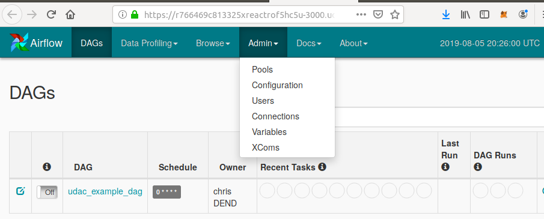
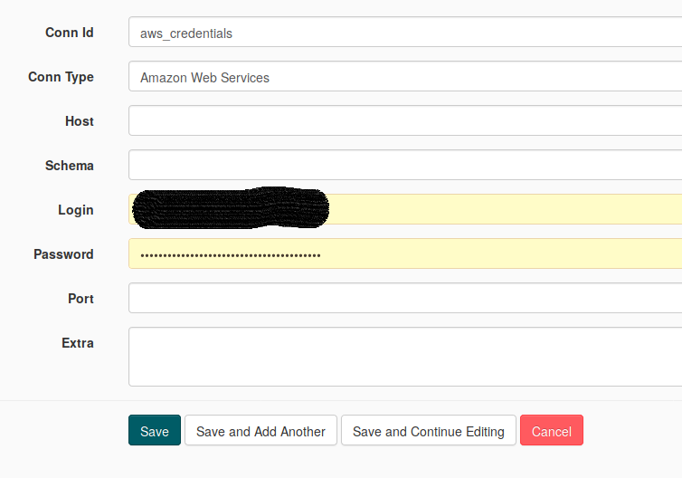
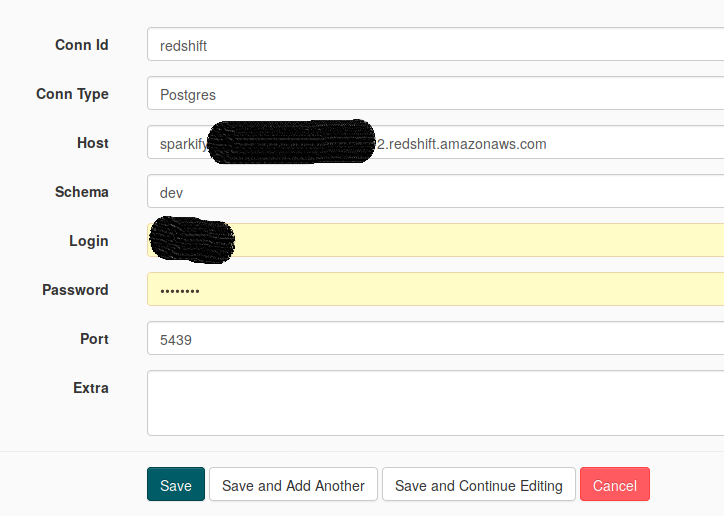
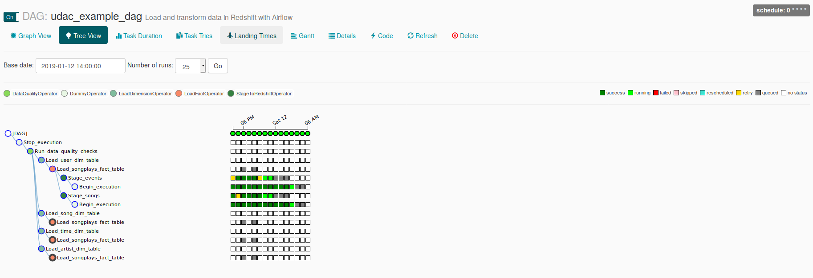

# DEND - PROJECT 5 - Data Pipelines with AIRFLOW
A music streaming company, Sparkify, has decided that it is time to introduce more automation and monitoring to their data warehouse ETL pipelines and come to the conclusion that the best tool to achieve this is Apache Airflow.

The project is to create data pipelines that are dynamic and built from reusable tasks, can be monitored, and allow easy backfills. They have also noted that the data quality plays a big part when analyses are executed on top the data warehouse and want to run tests against their datasets after the ETL steps have been executed to catch any discrepancies in the datasets.

The source data resides in S3 and needs to be processed in Sparkify's data warehouse in Amazon Redshift. The source datasets consist of JSON logs that tell about user activity in the application and JSON metadata about the songs the users listen to.

## Overview.
A workspace was provided by Udacity with AIRFLOW and all necessary tools installed. 
The project consist of a DAG, 4 operators and some SQL queries to perform all ETL. 

The DAG is executing the operators in the following order


## Get started.
A redshift cluster is required before we can run the DAG. Idecided to use the scripts we used in our previous projects to built the cluster. The same can be achieved through the AWS UI, but I prefer a script because it provides some extra learning.

The script is located in a jupyter notebook and is executed as we learned in our previous projects (see project 3). 
The readme file of project 3 explains more about the script (create AWS cluster) and I believe the comments in the notebook are self explaining. 

## Open AIRFLOW
Start AIRFLOW from a terminal in your workspace and execute ```/opt/airflow/start.sh```

This will start the AIRFLOW webserver and enables the AIRFLOW UI
The UI can be accessed by clicking on the **AIRFLOW** button or in case AIFLOW is running locally it can be accessed through [AirFlow UI](http://localhost:8080/admin/)

## General goal
JSON files are located in 2 folders in a S3 bucket:
* Folder 1: log data, Folder 2: song data. The first operator is copying all data in the JSON files into the staging tables in a postgres db located in the cluster
* After all data is copied, an ETL is populating a songplay (FACT) table.
* thereafter, ETL is populating the remaining dimension tables (songs, artists, users and song)

All these steps are performed by running the operators

## Configure some connections before enabling (running) the DAG.



Two connection are required before we can run the DAG
1. AWS_Credentials: this are the Amazon Webservices credentials



2. Redshift: this is the actual cluster with a postgres db



## Running the DAG
Click enable and monitor the execution of the different steps through the AIRFLOW UI


